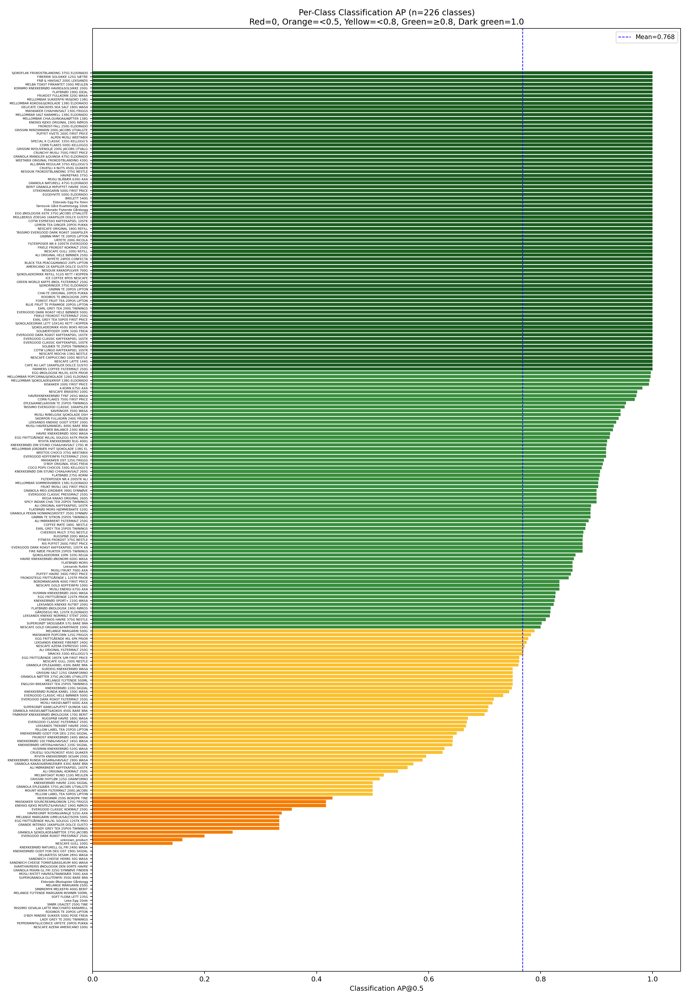
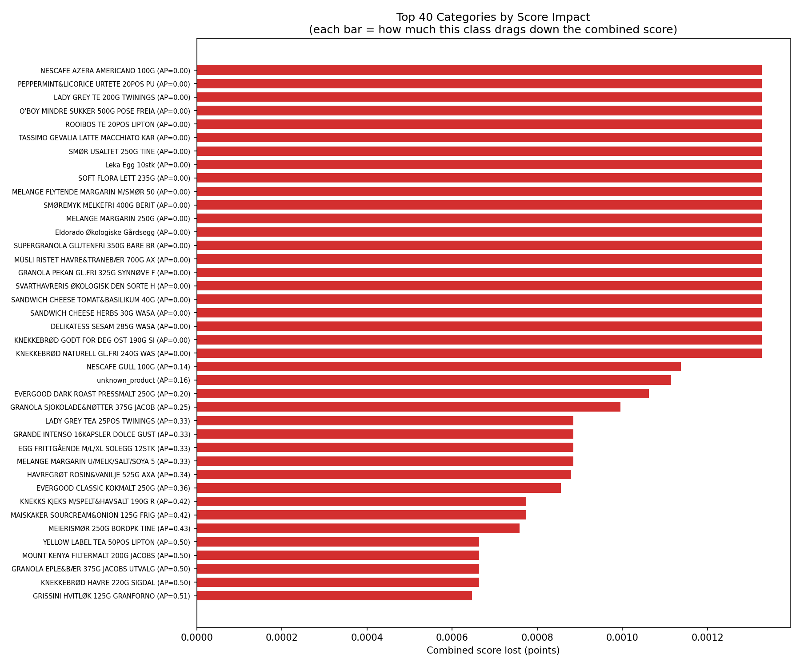
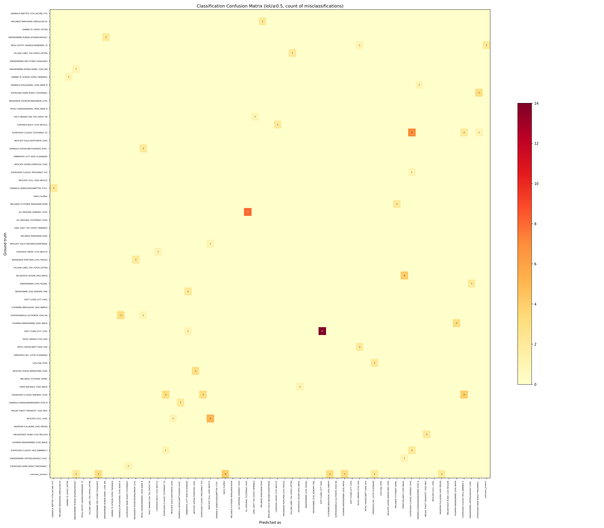
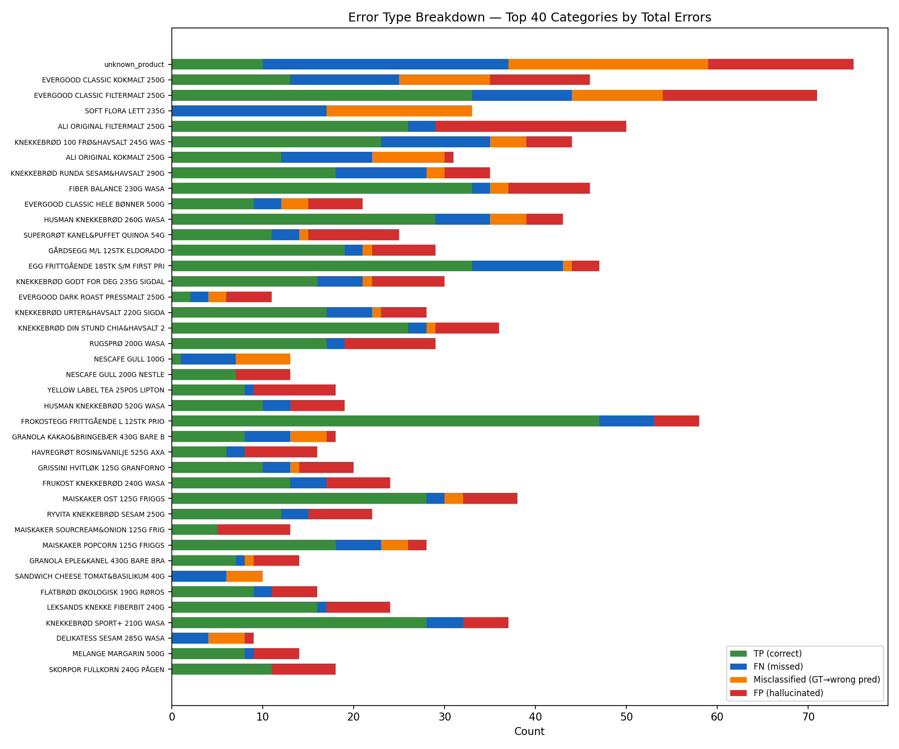
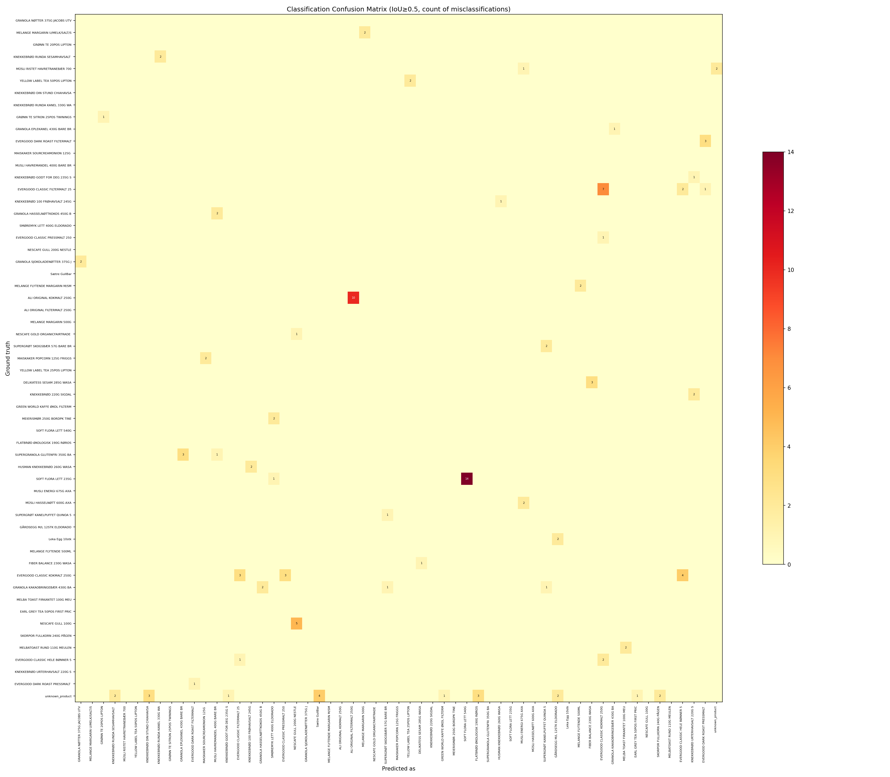
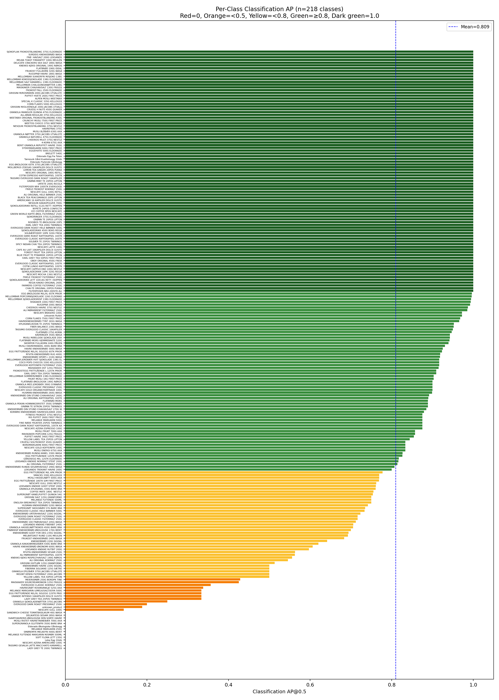
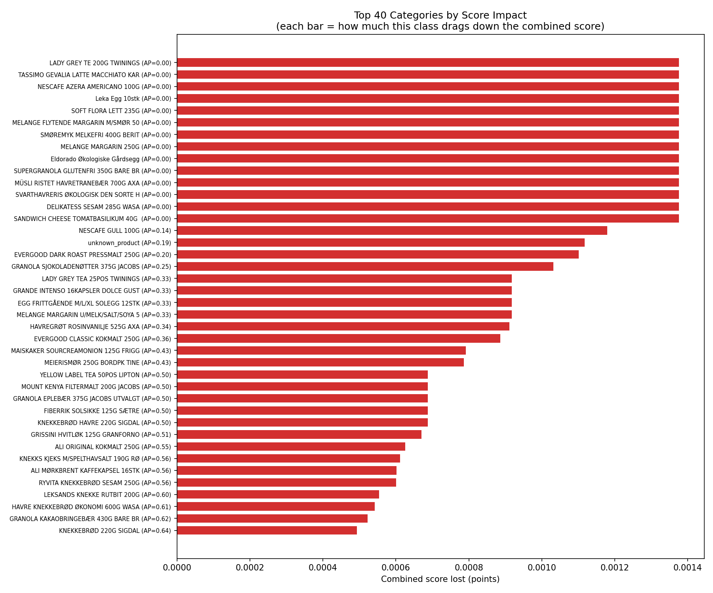
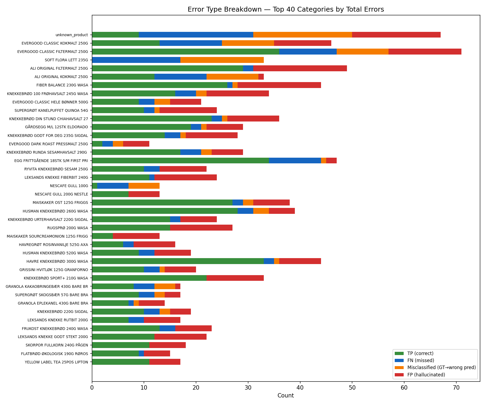

# Classification Error Analysis

Deep analysis of classification errors on the 25-image holdout set using `checkpoint_1e-3_train_split.pth` (epoch 54, lr=1e-3).

Run with: `uv run python classification_analysis.py --checkpoint <ckpt.pth>`

Plots saved to `classification_analysis/`.

---

## Plots

### Per-Class AP Distribution

### Score Impact by Category

### Confusion Matrix

### Error Type Breakdown

---

## Competition Score Breakdown

| Metric | Value | Weight | Contribution |
|--------|-------|--------|-------------|
| Detection mAP@0.5 | 0.8922 | 0.7 | 0.6245 |
| Classification mAP@0.5 | 0.7676 | 0.3 | 0.2303 |
| **Combined score** | **0.8548** | | |
| Gap to perfect | 0.1452 | | |

### Where the 0.145 gap comes from

| Source | Points lost | % of gap | What it means |
|--------|-----------|----------|--------------|
| **Missed GT (FN)** | **0.049** | **34%** | 156 GT boxes undetected |
| False positives (FP) | 0.027 | 18% | 268 spurious detections |
| **Classification errors** | **0.070** | **48%** | Wrong class labels on detected boxes |

Classification is the biggest single source of lost score — nearly half the gap.

### Detection stats (IoU≥0.5)

- Total GT: 2233, Total predictions: 2345
- TP: 2077, FP: 268, FN: 156
- Precision: 0.886, Recall: 0.930
- If all FPs removed: det mAP → 0.930 (+0.038)
- Remaining gap after removing FPs is entirely from missed GT

### Confidence threshold sensitivity

Threshold has almost no effect — predictions are well-calibrated:

| Threshold | Det mAP | Cls mAP | Combined | Preds |
|-----------|---------|---------|----------|-------|
| 0.00 | 0.8922 | 0.7676 | 0.8548 | 2345 |
| 0.20 | 0.8922 | 0.7676 | 0.8548 | 2345 |
| 0.30 | 0.8798 | 0.7615 | 0.8443 | 2272 |
| 0.50 | 0.8517 | 0.7433 | 0.8192 | 2154 |

---

## Per-Class AP Distribution

See `classification_analysis/per_class_ap.png`.

- 226 classes evaluated (have ≥1 GT in holdout)
- Mean AP: 0.768
- 22 classes at AP = 0.0 (zero correct predictions)
- 79 classes at AP = 1.0 (perfect)
- 147 classes (65%) at AP ≥ 0.8

| AP range | Classes | % |
|----------|---------|---|
| AP = 1.0 | 79 | 35.0% |
| AP ≥ 0.9 | 114 | 50.4% |
| AP ≥ 0.8 | 147 | 65.0% |
| AP ≥ 0.5 | 191 | 84.5% |
| AP ≥ 0.1 | 204 | 90.3% |
| AP = 0.0 | 22 | 9.7% |

### What fixing the worst classes would gain

| Fix worst N → AP=1.0 | New cls mAP | Cls gain | New combined | Combined gain |
|-----------------------|-------------|----------|--------------|---------------|
| 5 | 0.790 | +0.022 | 0.862 | +0.007 |
| 10 | 0.812 | +0.044 | 0.868 | +0.013 |
| 20 | 0.856 | +0.089 | 0.881 | +0.027 |
| 50 | 0.934 | +0.166 | 0.905 | +0.050 |

**The top 60 worst classes account for 0.054 of the 0.070 classification gap (77%).**

---

## 22 Categories with AP = 0.0

Every one of these has zero correct classifications in the holdout set.

| Cat | GT | FN | Confused as | Has ref img? | Root cause |
|-----|---:|---:|-------------|-------------|------------|
| SOFT FLORA LETT 235G | 17 | 17 | 14x → 540G variant | YES | Identical packaging, only tub size differs |
| SANDWICH CHEESE TOMAT&BASILIKUM 40G WASA | 6 | 6 | Mixed | YES | Small package, visually similar to other Wasa |
| NESCAFE AZERA AMERICANO 100G | 4 | 4 | 3x → Espresso variant | YES | Same can, different small text |
| SUPERGRANOLA GLUTENFRI 350G BARE BRA | 4 | 4 | 3x → Eple&Kanel variant | YES | Same brand layout |
| DELIKATESS SESAM 285G WASA | 4 | 4 | 4x → Fiber Balance | YES | Similar Wasa packaging |
| MELANGE FLYTENDE MARGARIN M/SMØR 500ML | 3 | 3 | 2x → Melange Flytende | NO | No ref image, holdout-only category |
| MÜSLI RISTET HAVRE&TRANEBÆR 700G AXA | 3 | 3 | 2x → unknown_product | YES | Rare category |
| LADY GREY TE 200G TWININGS | 2 | 2 | — | YES | Only 2 GT, no predictions at all |
| Leka Egg 10stk | 2 | 2 | 2x → Gårdsegg Eldorado | NO | Holdout-only, no ref image |
| SMØREMYK MELKEFRI 400G BERIT | 2 | 2 | 1x → Gårdsegg Eldorado | NO | Holdout-only, no ref image |
| Eldorado Økologiske Gårdsegg | 2 | 2 | — | NO | No ref image |
| GRANOLA PEKAN GL.FRI 325G SYNNØVE FINDEN | 2 | 2 | — | YES | Holdout-only, never seen in training |
| MELANGE MARGARIN 250G | 1 | 1 | 1x → 500G variant | YES | Size variant confusion |
| PEPPERMINT&LICORICE URTETE 20POS PUKKA | 1 | 1 | 1x → Chai Pukka | YES | Similar Pukka packaging |
| O'BOY MINDRE SUKKER 500G POSE FREIA | 1 | 1 | 1x → O'Boy Original | YES | Same brand, variant |
| ROOIBOS TE 20POS LIPTON | 1 | 1 | — | YES | Only 1 GT |
| TASSIMO GEVALIA LATTE MACCHIATO KARAMELL | 1 | 1 | 1x → Tassimo Evergood | YES | Holdout-only |
| SMØR USALTET 250G TINE | 1 | 1 | 1x → Egg product | YES | Only 1 GT |
| SVARTHAVRERIS ØKOLOGISK DEN SORTE HAVRE | 1 | 1 | 1x → Havregrøt variant | YES | Same brand |
| SANDWICH CHEESE HERBS 30G WASA | 1 | 1 | — | YES | Only 1 GT |
| KNEKKEBRØD GODT FOR DEG OST 190G SIGDAL | 1 | 1 | — | YES | Only 1 GT |
| KNEKKEBRØD NATURELL GL.FRI 240G WASA | 1 | 1 | — | YES | Holdout-only |

---

## Top 60 Worst Products — Score Impact Table

Each row shows how much a single category drags down the combined competition score.

| Rank | Loss | AP | GT | TP | FN | FP | Conf | Img? | Name | Top confusion |
|------|------|---:|---:|---:|---:|---:|-----:|------|------|---------------|
| 1 | 0.00133 | 0.00 | 4 | 0 | 4 | 0 | 3 | YES | NESCAFE AZERA AMERICANO 100G | 3x → Espresso |
| 2–22 | 0.00133 | 0.00 | 1–17 | 0 | — | — | — | Mixed | *(all 22 zero-AP classes, see above)* | |
| 23 | 0.00114 | 0.14 | 7 | 1 | 6 | 0 | 6 | YES | NESCAFE GULL 100G | 5x → 200G |
| 24 | 0.00111 | 0.16 | 37 | 10 | 27 | 16 | 22 | NO | unknown_product | 4x → Sætre GullBar |
| 25 | 0.00106 | 0.20 | 4 | 2 | 2 | 5 | 2 | YES | EVERGOOD DARK ROAST PRESSMALT 250G | mixed |
| 26 | 0.00100 | 0.25 | 4 | 1 | 3 | 0 | 2 | YES | GRANOLA SJOKOLADE&NØTTER JACOBS | 2x → Nøtter variant |
| 32 | 0.00085 | 0.36 | 25 | 13 | 12 | 11 | 10 | YES | EVERGOOD CLASSIC KOKMALT 250G | 4x → Hele Bønner |
| 42 | 0.00060 | 0.55 | 22 | 12 | 10 | 1 | 8 | YES | ALI ORIGINAL KOKMALT 250G | 8x → Filtermalt |
| 55 | 0.00044 | 0.67 | 44 | 33 | 11 | 17 | 10 | YES | EVERGOOD CLASSIC FILTERMALT 250G | 7x → Kokmalt |

**Cumulative loss from top 60: 0.054 out of 0.070 total cls gap (77%).**

---

## Confusion Clusters

Connected groups of products that mutually confuse each other, sorted by combined score impact.

### Cluster 1: Knekkebrød + unknown mega-cluster (impact: 0.0061)

12 interconnected products including Husman, Runda, unknown_product, Gårdsegg, knekkebrød variants. The `unknown_product` category acts as a hub — it gets confused with many real products.

### Cluster 2: Evergood Classic variants (impact: 0.0018)

| Product | AP | GT | Ref img? |
|---------|---:|---:|----------|
| EVERGOOD CLASSIC KOKMALT 250G | 0.36 | 25 | YES |
| EVERGOOD CLASSIC FILTERMALT 250G | 0.67 | 44 | YES |
| EVERGOOD CLASSIC HELE BØNNER 500G | 0.73 | 12 | NO |
| EVERGOOD CLASSIC PRESSMALT 250G | 0.90 | 10 | NO |

All have identical red bags — only tiny text at top differs ("FILTERMALT" vs "KOKMALT" vs "PRESSKANNEMALT"). Two variants (Hele Bønner, Pressmalt) are missing product reference images.

### Cluster 3: Melange Flytende (impact: 0.0017)

MELANGE FLYTENDE MARGARIN M/SMØR 500ML (AP=0.00, no ref image) confused with MELANGE FLYTENDE 500ML (AP=0.75).

### Cluster 4: Bare Bra Granola (impact: 0.0016)

SUPERGRANOLA GLUTENFRI (AP=0.00) confused with GRANOLA EPLE&KANEL (AP=0.76). Same brand box layout.

### Cluster 5: Nescafé Azera (impact: 0.0016)

Americano (AP=0.00) vs Espresso (AP=0.77). Same can, different text at bottom. Both have ref images.

### Cluster 6: Nescafé Gull (impact: 0.0015)

100G (AP=0.14) vs 200G (AP=0.76). Identical label, different jar size. Both have ref images.

### Cluster 7: Evergood Dark Roast (impact: 0.0014)

Pressmalt (AP=0.20) vs Filtermalt (AP=0.72). Same black bag, tiny text differs. Both have ref images.

### Cluster 8: Wasa Delikatess/Fiber (impact: 0.0014)

DELIKATESS SESAM (AP=0.00) confused 4x with FIBER BALANCE. Similar Wasa packaging.

### Cluster 9: Soft Flora Lett (impact: 0.0013)

235G (AP=0.00, 14x confused) vs 540G. **Identical packaging**, only tub size differs. Both have ref images. 17 GT boxes, zero correct.

### Cluster 10–20: Smaller clusters

Including Jacobs Granola variants, Melange Margarin size variants, Yellow Label Tea pack sizes, Maiskaker flavors, Ali Original grind types, Sigdal knekkebrød variants, Müsli/AXA variants, Cheerios variants. All have ref images.

---

## Product Reference Image Coverage

From `NM_NGD_product_images.zip` — 344 product folders by barcode/EAN, `metadata.json` maps barcode → product name.

- **321 of 356 categories (90.2%) have product reference images** (94.5% of annotations)
- **35 categories lack product images** (5.5% of annotations)

### Missing reference images — score impact

Categories without reference images only cost **0.0071 combined** (10% of the classification gap). Most are either `unknown_product` (0.0011 alone), egg products from local farms, or coffee grind variants.

| Category | AP | GT | Loss | Has images |
|----------|---:|---:|-----:|-----------|
| Leka Egg 10stk | 0.00 | 2 | 0.00133 | NO |
| MELANGE FLYTENDE MARGARIN M/SMØR 500ML | 0.00 | 3 | 0.00133 | NO |
| SMØREMYK MELKEFRI 400G BERIT | 0.00 | 2 | 0.00133 | NO |
| Eldorado Økologiske Gårdsegg | 0.00 | 2 | 0.00133 | NO |
| unknown_product | 0.16 | 37 | 0.00111 | NO |
| EVERGOOD CLASSIC HELE BØNNER 500G | 0.73 | 12 | 0.00035 | NO |
| Leksands Rutbit | 0.86 | 14 | 0.00019 | NO |
| EVERGOOD CLASSIC PRESSMALT 250G | 0.90 | 10 | 0.00013 | NO |

**Key insight**: Missing reference images are NOT the main problem. The biggest classification losses come from products that DO have reference images but look nearly identical to each other.

---

## Confused Pairs — Visual Comparison

Product reference images confirm that top confusion pairs have **near-identical packaging**:

| Pair | Confusions | What differs | Both have ref imgs? |
|------|-----------|-------------|-------------------|
| Soft Flora Lett 235G vs 540G | 14 | Nothing — identical label, only tub size | YES |
| Ali Kokmalt vs Filtermalt 250G | 8 | Tiny "KOKMALT"/"FILTERMALT" text at top | YES |
| Evergood Classic Filtermalt vs Kokmalt | 7 | Tiny text at top of identical red bag | YES |
| Nescafé Gull 100G vs 200G | 5 | Identical label, different jar size | YES |
| Delikatess Sesam vs Fiber Balance (Wasa) | 4 | Similar Wasa layout | YES |
| Nescafé Azera Americano vs Espresso | 3 | Same can, different text at bottom | YES |
| Evergood Dark Roast Filter vs Press | 3 | Tiny text at top of identical black bag | YES |
| Husman Knekkebrød 260G vs 520G | 3 | Same design, box is wider | YES |
| Supergranola Glutenfri vs Eple&Kanel | 3 | Same brand layout | YES |
| Granola Kakao vs Hasselnøtt (Bare Bra) | 2 | Same layout, different flavor text + food photo | YES |

These are OCR-level distinctions — the model would need to read small text or estimate physical size from shelf context.

---

## Cleaned Labels Comparison

The cleaned annotations (`data/dataset/train/_annotations.coco.json`) fix mislabeled/duplicate/spurious GT boxes. Scoring the same model against both label sets:

|  | Original | Cleaned | Delta |
|--|---------|---------|-------|
| **Detection mAP@0.5** | 0.8922 | 0.9057 | **+0.014** |
| **Classification mAP@0.5** | 0.7676 | 0.8095 | **+0.042** |
| **Combined score** | 0.8548 | 0.8768 | **+0.022** |
| GT boxes (holdout) | 2233 | 2093 | -140 |
| Zero-AP classes | 22 | 14 | -8 |
| Perfect-AP classes | 79 | 88 | +9 |

Key observations:
- **+0.022 combined** from label cleaning alone — the model is better than the original labels suggested
- Classification improves most (+0.042 cls mAP): cleaning fixed mislabeled annotations that penalized correct predictions
- Recall jumps from 0.930 to 0.955: removed GT boxes were products the model correctly didn't detect (bad annotations)
- **img_00304** (-77 boxes) and **img_00296** (-48 boxes) had the largest reductions — these were our worst images, largely due to noisy GT
- Gap structure stays similar (54% detection / 46% classification), total gap shrinks 0.145 → 0.123

### Confusion matrix on cleaned labels

### Per-class AP on cleaned labels

### Score impact on cleaned labels

### Error breakdown on cleaned labels

---

## Actionable Next Steps

1. **Contrastive augmentation using product reference images**: We have reference images for most confused pairs. Could generate synthetic training patches placing confused products side-by-side, forcing the model to learn the subtle differences.

2. **Focus on the 22 zero-AP classes first**: These are the lowest-hanging fruit. Each one fixed to AP=1.0 gains 0.00133 combined (0.029 total if all 22 fixed).

3. **Address confusion clusters holistically**: The Evergood Classic cluster (4 products), Nescafé cluster (2 products), and Soft Flora cluster (2 products) together account for ~0.006 combined score. Targeted training data for these specific groups would have outsized impact.

4. **Consider merging indistinguishable size variants**: For Soft Flora 235G/540G, the packaging is literally identical — the model can only distinguish them by physical size on shelf, which may be unreliable. Merging these into one class would convert 14 misclassifications into correct predictions, gaining ~0.001 combined.

5. **Collect missing reference images**: 8 categories lack both product images and have non-zero score impact. Priority: Evergood Classic Hele Bønner (0.00035), Evergood Classic Pressmalt (0.00013).
